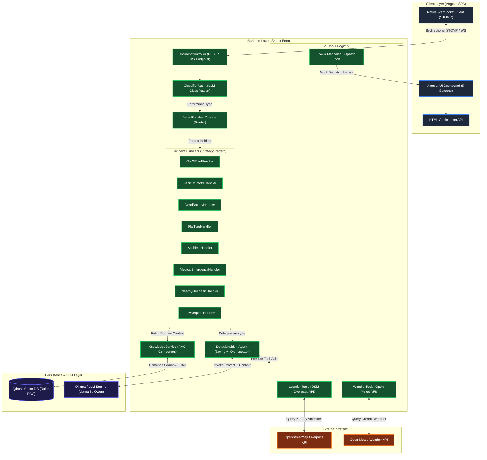
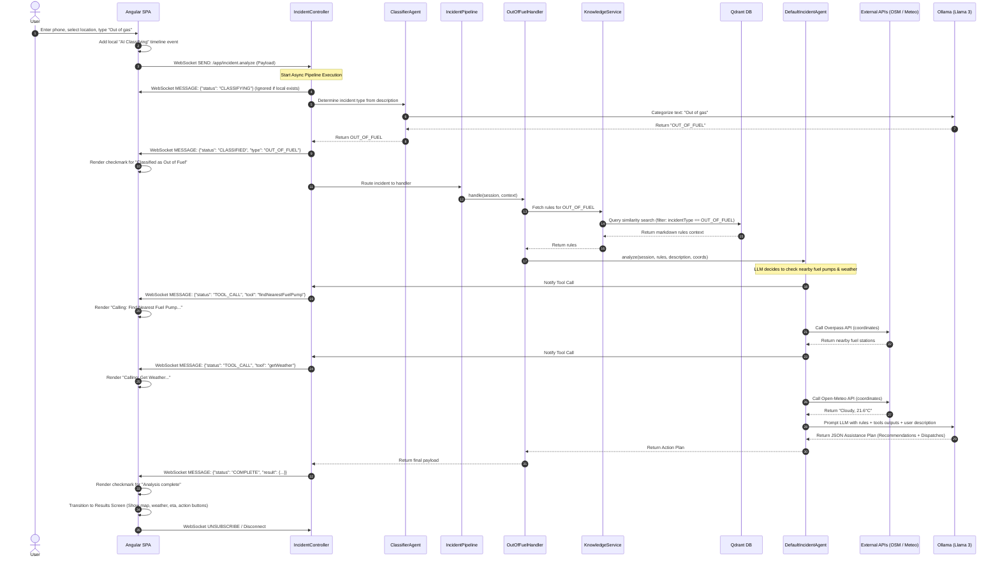
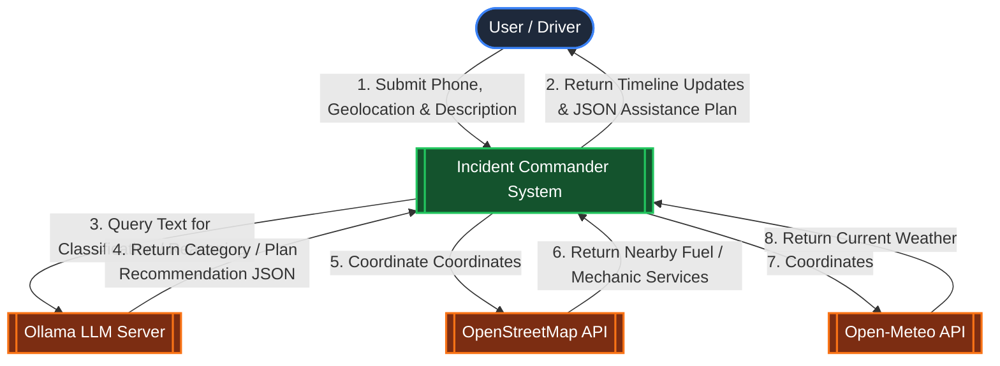
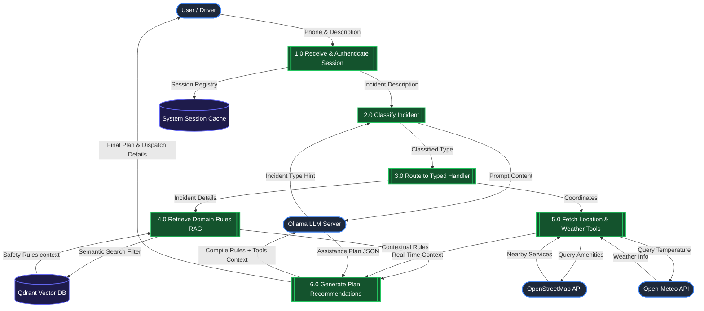

# Roadside Assistance (RSA) System Architecture

This document presents the system architecture of the Incident Commander platform. It covers the high-level components, the detailed request-response pipeline, and the sequence of interactions that occur when a roadside emergency is reported.

---

## 1. High-Level Component Architecture

The diagram below maps the interaction between the Angular Single-Page Application (SPA), the Spring Boot backend, the Qdrant Vector database, the LLM service (Ollama), and external APIs (OpenStreetMap Overpass and Open-Meteo).

---

## 2. Sequence Diagram: End-to-End Processing

The sequence diagram below displays the detailed interaction sequence for an incident request, highlighting how progress updates (`CLASSIFYING`, `CLASSIFIED`, `TOOL_CALL`, `COMPLETE`) are pushed back to the client in real-time.

---

## 3. High-Quality Design Decisions

### Real-Time Event Streaming
- **WebSocket STOMP Channel**: Instead of long-polling, a native bi-directional WebSocket connection communicates events instantly.
- **Granular Progress Timeline**: The UI maps backend stages (`CLASSIFYING` -> `CLASSIFIED` -> `TOOL_CALL` -> `COMPLETE`) straight to interactive checkmarks, enhancing perceived speed.

### Extensible Strategy Pattern
- **Decoupled Handlers**: Handlers inherit from a common base and register themselves to the pipeline dynamically. Adding a new incident type only requires writing a single subclass.

### AI RAG (Retrieval Augmented Generation)
- **Qdrant Embedding Store**: Markdown rules are vectorized using Ollama embeddings and loaded at startup. Handlers fetch matching rules and inject them directly into LLM prompts.
- **Dynamic Tool Execution**: The LLM autonomously decides when to check weather or location details via OpenStreetMap/Open-Meteo APIs, adapting recommendations to real-world contexts.

---

## 4. Data Flow Diagrams (DFD)

### Level 0 DFD: System Context Diagram

The Level 0 Context Diagram shows the boundaries of the Incident Commander system, highlighting key external actors (Driver/User) and external API dependencies.

### Level 1 DFD: Component Data Flow Diagram

The Level 1 DFD describes the internal processes of the application, showing how data transitions from raw user input into structured recommendations by querying vector stores and calling external APIs.

